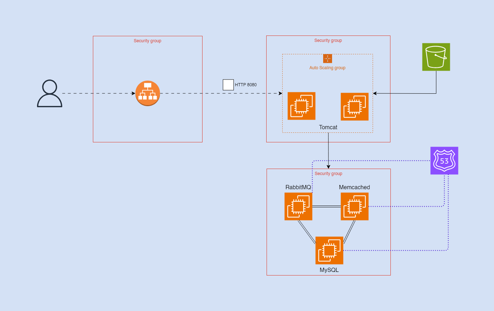
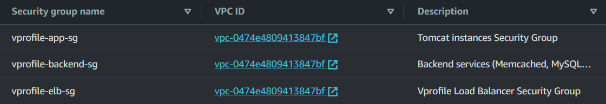
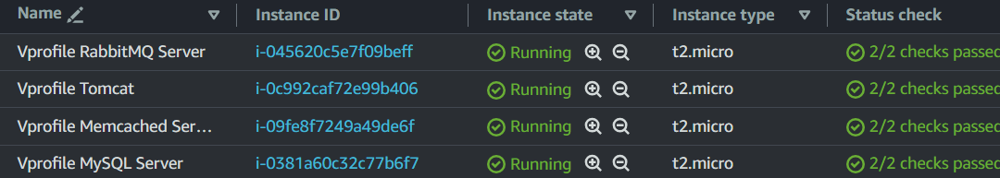
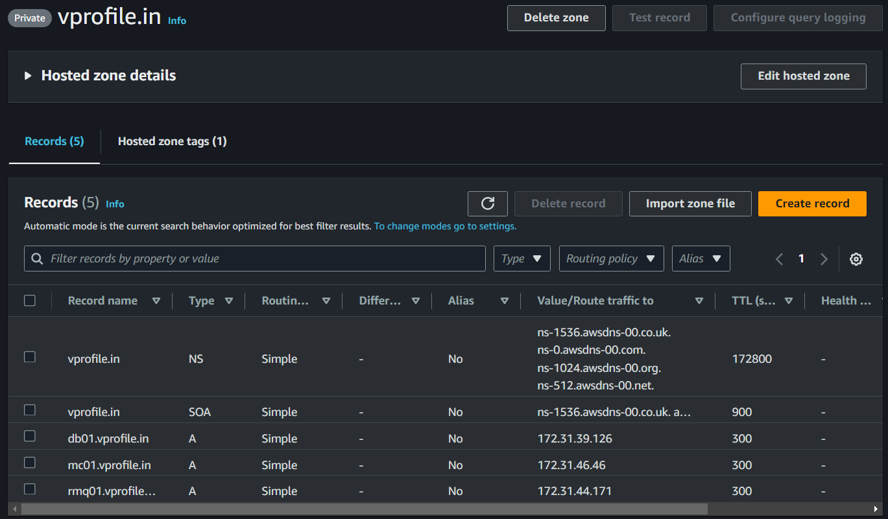
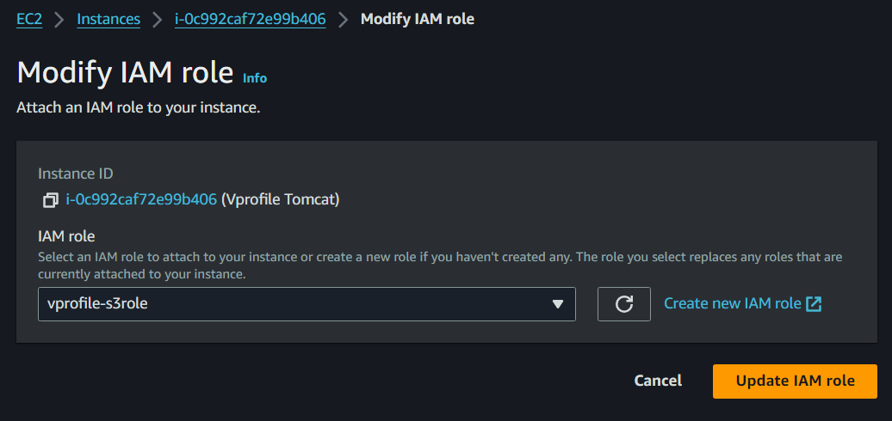
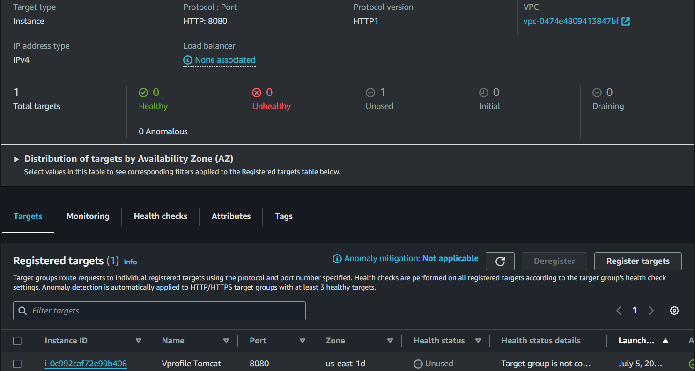
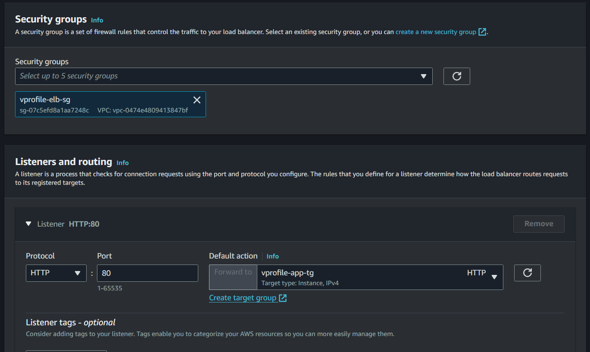
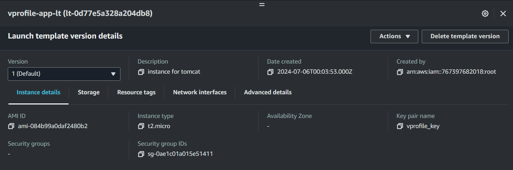
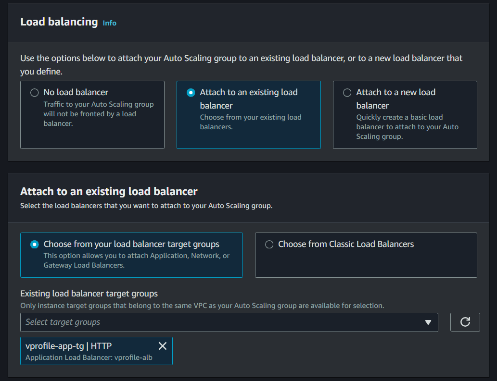
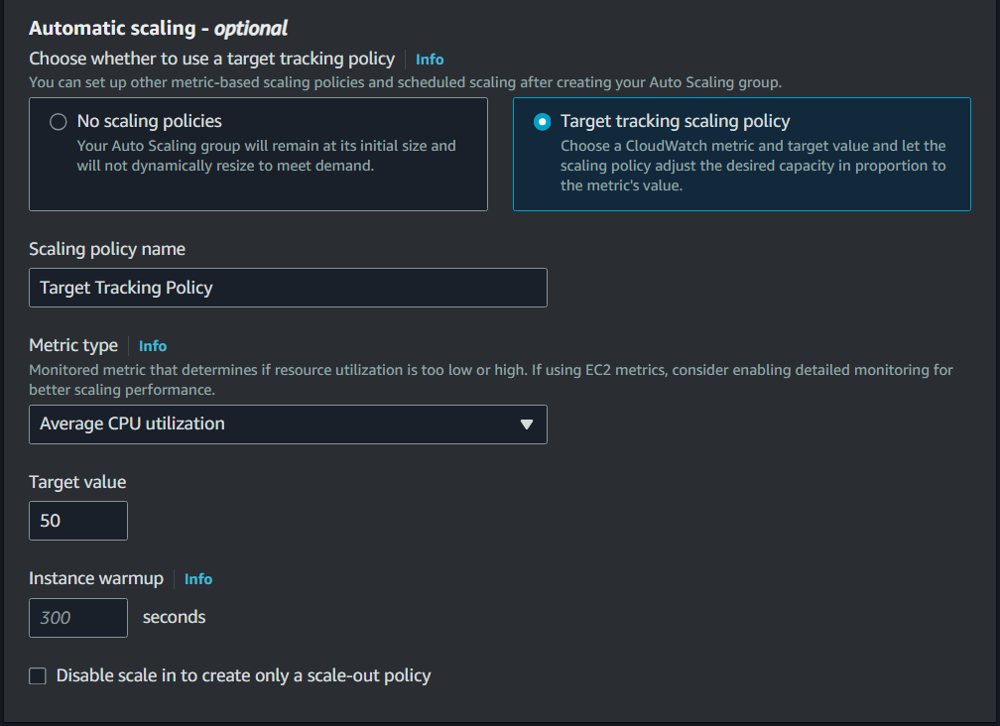

# Multi-Tier Application Deployment on AWS (Lift and Shift)

This project (from the DevOps Udemy Course by Imran Teli) demonstrates a Lift and Shift migration of the Vprofile application from the VirtualBox environment to AWS. The following steps provide a detailed guide for the setup and configuration required for a successful migration.

## Table of Contents
- [Requirements](#requirements)
- [Architecture](#architecture)
- [Steps](#steps)
- [Usage](#usage)

## Requirements
- AWS Account
- AWS CLI installed and configured
- Maven installed
- Knowledge of AWS services such as EC2, S3, IAM, Route 53, and Auto Scaling
- SSH client

## Architecture
The architecture for this project includes the following components:
1. **EC2 Instances**: Hosting the application.
2. **S3**: Storing the application artifact.
3. **IAM Roles and Policies**: Managing access permissions.
4. **Route 53**: Managing DNS records.
5. **Application Load Balancer (ALB)**: Distributing traffic across EC2 instances.
6. **Auto Scaling Group**: Automatically scaling the number of instances based on demand.



## Steps
### 1. Create Security Groups and Key Pairs
**Security Groups**: Configure security groups to control inbound and outbound traffic to your AWS resources. Ensure the necessary ports are open.

**Key Pairs**: Generate key pairs to enable secure SSH access to your EC2 instances.



### 2. Launch EC2 Instances
Launch EC2 instances to host your application. Select the appropriate instance type based on your application’s resource requirements.

**Verify Services**:
- Check the status of services using: `systemctl status servicename`
- Verify open ports using: `ss -tulnp | grep portnumber`




### 3. Configure Route 53
Set up a hosted zone in Route 53 for DNS management. Create records for your backend servers using their private IP addresses to facilitate internal communication.

**Steps**:
- Navigate to Route 53 in the AWS Management Console.
- Create a new hosted zone for your domain.
- Add A records for your backend servers with their private IP addresses.




### 4. Build the Application
- Edit the `application.properties` file to specify the appropriate domains for the `vprofile` application.
- Build the application using Maven: `mvn install`. This will generate the deployable artifact (`vprofile-v2.war`).

### 5. Store the Artifact in S3
- **Create IAM User**: Create an IAM user with full S3 access and generate access keys.
- **Configure AWS CLI**: Configure the AWS CLI with the generated access keys using: `aws configure`
- **Create S3 Bucket**: Create an S3 bucket to store the artifact: `aws s3 mb s3://some-bucket-unique-name`
- **Upload Artifact**: Upload the artifact to the S3 bucket: `aws s3 cp target/vprofile-v2.war s3://some-bucket-unique-name/`

### 6. Deploy the Artifact
- **Create IAM Role**: Create an IAM role that grants EC2 instances access to S3. Attach this role to your Tomcat instance.
- **Create IAM Role**: Create an IAM role that grants EC2 instances access to S3. Attach this role to your Tomcat instance.
- **Modify Instance Roles**: Modify the roles of the Tomcat instance to grant the created role.



- **Retrieve Artifact**: From the tomcat EC2 instance download the artifact from S3:
    ```sh
    aws s3 cp s3://artifact-bucket-name/vprofile-v2.war /tmp/
    ```
- **Deploy Artifact**:
    ```sh
    systemctl stop tomcat
    rm -rf /opt/tomcat/webapps/ROOT*
    cp /tmp/vprofile-v2.war /opt/tomcat/webapps/ROOT.war
    systemctl start tomcat
    chown tomcat:tomcat /opt/tomcat/webapps -R
    ```

### 7. Create a Load Balancer
Create an Application Load Balancer (ALB) to distribute incoming traffic across multiple targets.

- **Create Target Group**: Define a target group for your instances.



2. **Create ALB**: Set up an ALB and configure it to distribute traffic to the target group.



### 8. Configure Auto Scaling
Configure Auto Scaling to automatically adjust the number of EC2 instances based on demand.

- **Create AMI**: Create an Amazon Machine Image (AMI) from your application instance.
- **Create Launch Template**: Use the AMI to create a launch template.



3. **Create Auto Scaling Group**: Set up an auto-scaling group using the launch template and link it to the target group created earlier.



4. **Configure Health Checks**: Enable ELB health checks for the auto-scaling group.
5. **Set Scaling Policies**: Define the desired, minimum, and maximum number of instances and configure scaling policies.



## Usage
To use this setup, follow the steps outlined above to deploy and manage the Vprofile application on AWS. Monitor the application using AWS CloudWatch and adjust configurations as necessary to ensure optimal performance and cost efficiency.

