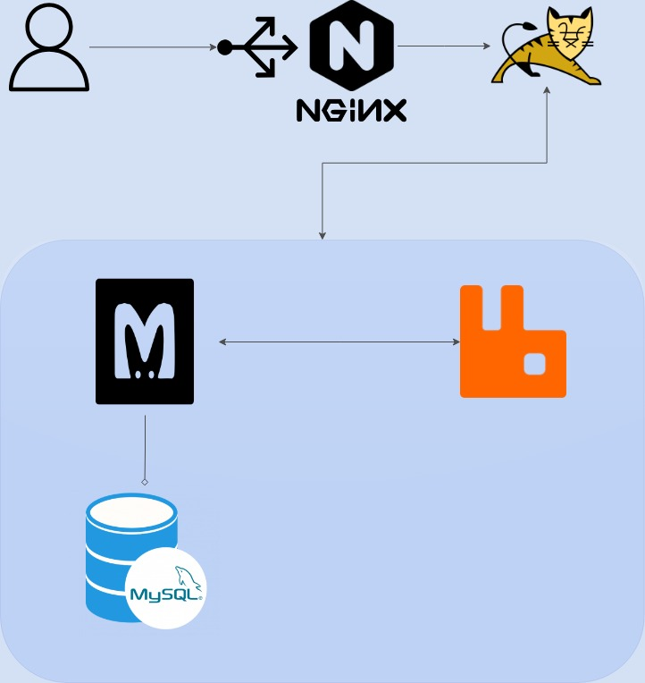

# Multi-Tier Application Deployment with Vagrant and VirtualBox

This project aims to deploy a multi-tier application on virtual machines using Vagrant and VirtualBox. The architecture involves several components, including NGINX, Tomcat, MySQL, RabbitMQ, and Memcached.

## Table of Contents
- [Introduction](#introduction)
- [Architecture](#architecture)
- [Prerequisites](#prerequisites)
- [Setup](#setup)
- [Usage](#usage)


## Introduction
This project (from the DevOps Udemy Course by Imran Teli) demonstrates how to deploy a multi-tier application on VMs using Vagrant and VirtualBox. The architecture includes a web server, application server, database server, cache server, and a message broker. The primary objective is to showcase the integration and deployment of these components in a virtualized environment.

## Architecture
The architecture of this project consists of the following components:

- **NGINX**: Serves as the reverse proxy and load balancer.
- **Tomcat**: Hosts the application server.
- **MySQL**: Provides the database services.
- **RabbitMQ**: Acts as the message broker.
- **Memcached**: Provides caching services to enhance performance.



## Prerequisites
To run this project, you need the following installed on your local machine:

- [VirtualBox](https://www.virtualbox.org/)
- [Git for Windows](https://git-scm.com/downloads) (if you are on windows)
- [Vagrant](https://www.vagrantup.com/)
- Vagrant plugin
  ```sh
  vagrant plugin install vagrant-hostmanager
  ```

## Setup
Follow these steps to set up and deploy the application:

1. **Initialize and start the Vagrant environment:**
    ```sh
    vagrant up
    ```

2. **Provision the VMs:**
    Vagrant will automatically provision the VMs based on the configuration provided in the `Vagrantfile`.

3. **Access the application:**
    Once the setup is complete, you can access the application through the NGINX server at `http://192.168.56.11:80`.

## Usage
- **NGINX**: Acts as the entry point for user requests, forwarding them to Tomcat.
- **Tomcat**: Handles the application logic and interacts with MySQL, Memcached, and RabbitMQ.
- **MySQL**: Stores application data.
- **Memcached**: Provides caching to improve application performance.
- **RabbitMQ**: Manages messaging and communication between different parts of the application.


